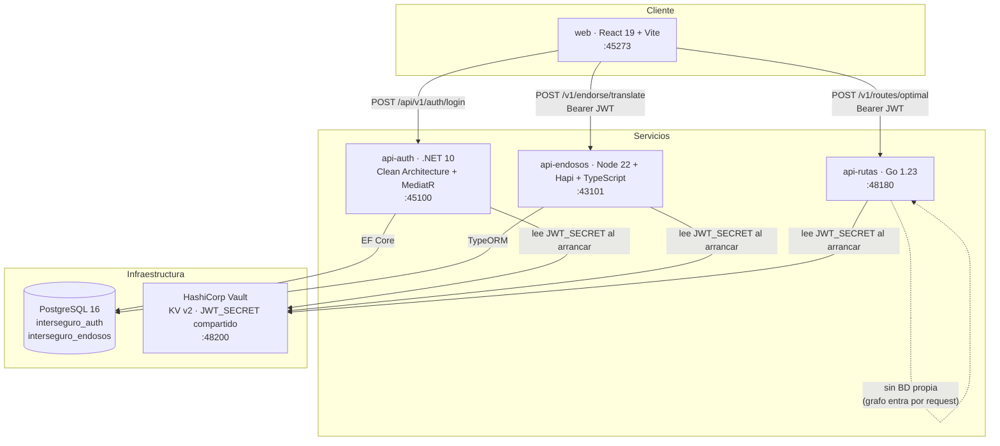
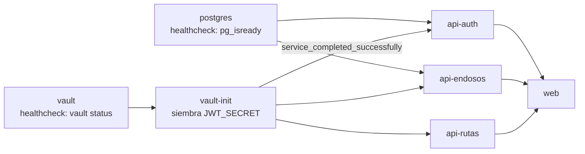
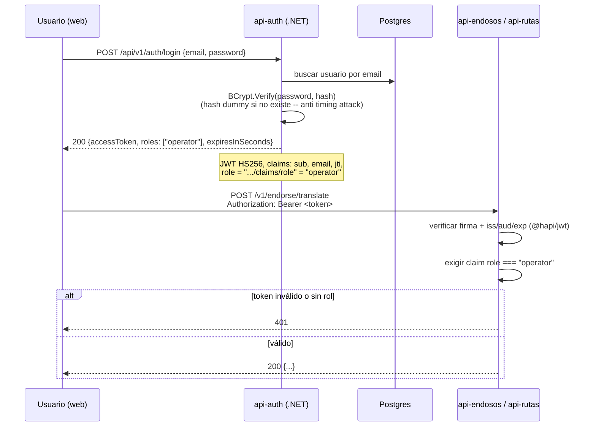
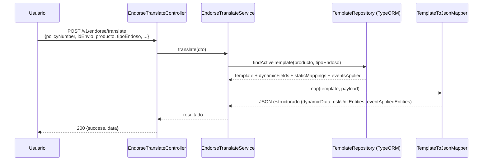
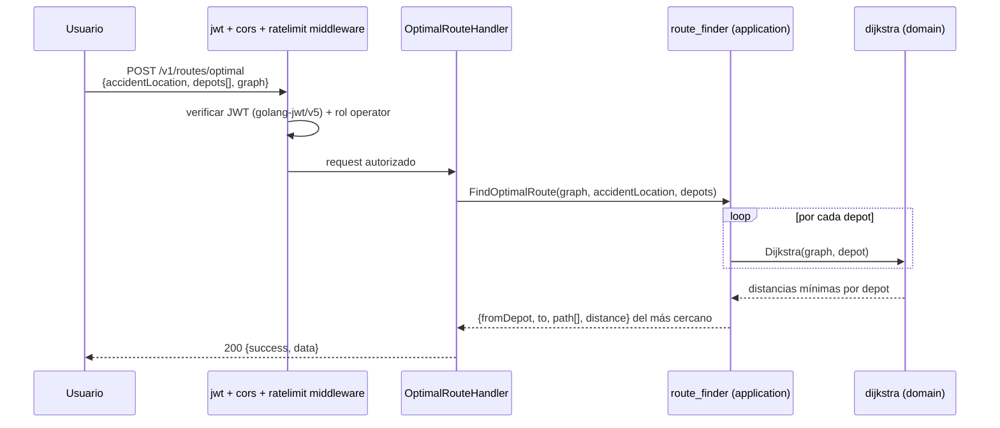

# Reto Técnico Interseguro — Technical Lead

Implementación de los dos ejercicios técnicos del reto (traductor de endosos y rutas óptimas),
deliberadamente **poliglota** — cada servicio en un lenguaje distinto — más un frontend único que
consume ambos. El reto 3 (diagrama de arquitectura) se entrega aparte.

## Dónde está cada reto

| Reto | UI (frontend) | Código (repo) |
|---|---|---|
| **Reto 1** — Traductor de Endosos | http://localhost:45273/endosos | `api-endosos/` (Node + Hapi + TypeScript) — lógica de mapeo en `api-endosos/src/features/endorse-translate/` · frontend en `web/src/features/endosos/` |
| **Reto 2** — Rutas Óptimas | http://localhost:45273/rutas-optimas | `api-rutas/` (Go) — algoritmo en `api-rutas/internal/domain/` y `api-rutas/internal/application/` · frontend en `web/src/features/rutas-optimas/` |
| **Reto 3** — Diagrama de Arquitectura | Card en la home (`http://localhost:45273/`) enlaza a la ruta de abajo — no tiene pantalla propia, es un diagrama estático | `docs/diagrams/reto3-arquitectura-prestamos-renta.drawio` — abrir con [draw.io](https://app.diagrams.net/) (`File → Open from → Device`) |

## Índice

- [Dónde está cada reto](#dónde-está-cada-reto)
- [Getting Started](#getting-started)
- [Arquitectura general](#arquitectura-general)
- [Stack tecnológico por servicio](#stack-tecnológico-por-servicio)
- [Secretos — HashiCorp Vault](#secretos--hashicorp-vault-no-env-sueltos)
- [Autenticación, autorización y rate limiting](#autenticación-autorización-y-rate-limiting)
- [Reto 1 — Traductor de Endosos](#reto-1--traductor-de-endosos-api-endosos)
- [Reto 2 — Rutas Óptimas](#reto-2--rutas-óptimas-api-rutas)
- [Frontend (web)](#frontend-web)
- [Verificación](#verificación)
- [Simplificaciones deliberadas](#simplificaciones-deliberadas-fuera-de-alcance-del-reto)

---

## Getting Started

### Prerrequisitos

- Docker + Docker Compose (todo corre containerizado, no hace falta instalar .NET/Node/Go localmente)
- Puertos `45432, 48200, 45100, 43101, 48180, 45273` libres (o editar `.env`, ver más abajo)

### Levantar todo

```bash
git clone https://github.com/UBF21/interseguro-reto-tecnico.git
cd interseguro-reto-tecnico
cp .env.example .env    # ajustar puertos si alguno choca con algo que ya tengas corriendo
docker compose up -d --build
```

Primer arranque: Postgres crea las 2 bases (`interseguro_auth`, `interseguro_endosos`) →
`vault-init` siembra el `JWT_SECRET` compartido en Vault → los 3 backends arrancan y lo leen de
ahí → `api-auth` corre sus migraciones EF Core y siembra el usuario demo → `api-endosos` siembra la
plantilla `Rumbo`/`CambioFrecuencia`. Todo automático, sin pasos manuales.

### Servicios y puertos

| Servicio | URL | Notas |
|---|---|---|
| web | http://localhost:45273 | frontend |
| api-auth | http://localhost:45100 | `POST /api/v1/auth/login` · Swagger en `/` |
| api-endosos | http://localhost:43101 | `POST /v1/endorse/translate` · Swagger en `/` |
| api-rutas | http://localhost:48180 | `POST /v1/routes/optimal` · Swagger en `/` |
| vault | http://localhost:48200 | UI en `/ui`, token: ver `.env` (`VAULT_ROOT_TOKEN`) |
| postgres | localhost:45432 | 2 bases: `interseguro_auth`, `interseguro_endosos` |

**Credenciales demo** (sembradas automáticamente al arrancar `api-auth`):
`operaciones@interseguro.pe` / `Reto2025!`

### Swagger / OpenAPI

Los 3 backends levantan la documentación interactiva **en la raíz** (`/`) — al abrir
http://localhost:45100, http://localhost:43101 u http://localhost:48180 en el navegador ya se ve
Swagger UI con todos los endpoints, sin tener que conocer una ruta especial de antemano.

Para probar un endpoint protegido desde la propia UI: primero `POST /api/v1/auth/login` con las
credenciales demo para obtener el JWT, después click en **Authorize** y pegar `Bearer <token>`
(el prefijo `Bearer ` va incluido en el valor, en los 3 servicios) — el candado del endpoint pasa
a cerrado y las siguientes llamadas ya incluyen el header `Authorization` automáticamente.

Es una feature **exclusiva de desarrollo** — el propio `docker-compose.yml` lo activa vía
`REPO_ENV=development` (default si no se setea nada) inyectado como `ASPNETCORE_ENVIRONMENT` /
`NODE_ENV` / `APP_ENV` según el stack de cada servicio; si `REPO_ENV=production`, los 3 backends
dejan de exponerla (`/` responde 404) sin tocar código.

Los puertos de host son configurables vía `.env` (`HOST_PORT_*`) por si alguno ya está ocupado en
tu máquina — los del ejemplo de arriba se eligieron deliberadamente **fuera** del rango convencional
(ni los defaults obvios como 5000/8080/5173/5432/8200, ni los "casi obvios" como
5100/3101/8180/5273/5532/8300) para minimizar la chance de choque con otro servicio, incluyendo un
proceso de desarrollo local (`npm run dev`, etc.) que haya quedado colgado en el mismo puerto que un
contenedor — eso pasó durante el desarrollo y el navegador terminó hablando con el proceso viejo en
vez del contenedor, dando errores de red difíciles de diagnosticar a simple vista.

### Probar los endpoints a mano (curl)

```bash
# 1. Login — obtiene el JWT compartido
TOKEN=$(curl -s -X POST http://localhost:45100/api/v1/auth/login \
  -H "Content-Type: application/json" \
  -d '{"email":"operaciones@interseguro.pe","password":"Reto2025!"}' \
  | jq -r '.data.accessToken')

# 2. Reto 1 — traducir un endoso
curl -s -X POST http://localhost:43101/v1/endorse/translate \
  -H "Authorization: Bearer $TOKEN" -H "Content-Type: application/json" \
  -d '{"policyNumber":"POL-123","idEnvio":1,"producto":"Rumbo","tipoEndoso":"CambioFrecuencia"}'

# 3. Reto 2 — ruta óptima
curl -s -X POST http://localhost:48180/v1/routes/optimal \
  -H "Authorization: Bearer $TOKEN" -H "Content-Type: application/json" \
  -d '{"accidentLocation":"San Isidro","depots":["Miraflores","Ate"],
       "graph":{"Miraflores":{"San Isidro":7,"Barranco":3},"San Isidro":{"Miraflores":7,"Lince":4},
                "Barranco":{"Miraflores":3,"Surco":5},"Lince":{"San Isidro":4,"Surco":6},
                "Surco":{"Barranco":5,"Lince":6,"Ate":10},"Ate":{"Surco":10}}}'
```

O simplemente entrar a http://localhost:45273, loguearse con la credencial demo y usar la UI.

### Correr un servicio individual fuera de Docker (dev local)

Cada API es autocontenida — tiene su propio `.env.example` con placeholders de desarrollo (sin
Vault de por medio):

```bash
# api-auth (.NET 10)
cd api-auth && cp .env.example .env && dotnet run --project src/ApiAuth.Api

# api-endosos (Node 22 + TypeScript)
cd api-endosos && cp .env.example .env && npm install && npm run dev

# api-rutas (Go 1.23)
cd api-rutas && cp .env.example .env && go run ./cmd/api

# web (React 19 + Vite)
cd web && npm install && npm run dev
```

Estructura del repo:

```
interseguro-reto-tecnico/
├── api-auth/          # .NET 10 — login, emite el JWT compartido (Clean Architecture + MediatR)
├── api-endosos/        # Node + Hapi + TypeScript — Reto 1: POST /v1/endorse/translate
├── api-rutas/           # Go — Reto 2: POST /v1/routes/optimal (Dijkstra)
├── web/                 # React 19 + Vite + shadcn/ui — frontend único para ambos retos
├── infra/               # scripts de init de Postgres y seed de Vault
└── docker-compose.yml   # orquesta los 6 servicios
```

Cada API es un proyecto 100% autocontenido (su propio `Dockerfile`, tests, `.env.example`) — se
podrían separar en 3 repos independientes sin tocar nada.

## Por qué 4 lenguajes distintos

Decisión explícita para demostrar manejo de stack políglota, no un accidente:

- **`api-auth` en .NET**: único punto de login, emite JWT (HS256) con un secreto compartido.
- **`api-endosos` en Node/Hapi**: pedido explícito del enunciado para el Reto 1.
- **`api-rutas` en Go**: pedido explícito del enunciado para el Reto 2.
- **`web` en React**: consume las 3 APIs desde un solo frontend.

Los 3 backends **validan el mismo JWT** (mismo secreto, mismo issuer/audience) — `api-auth` es el
único que lo emite, `api-endosos` y `api-rutas` solo lo verifican.

## Arquitectura general



`api-auth` es el único emisor del JWT; `api-endosos` y `api-rutas` solo lo verifican (mismo
secreto, issuer y audience, sembrados una sola vez en Vault por `vault-init` al arrancar el stack).

## Stack tecnológico por servicio

| | api-auth | api-endosos | api-rutas | web |
|---|---|---|---|---|
| Lenguaje | C# / .NET 10 | TypeScript / Node 22 | Go 1.23 | TypeScript |
| Framework HTTP | ASP.NET Core (`Asp.Versioning.Mvc` 8.1) | Hapi 21 | `net/http` (stdlib) | React 19 + Vite 8 |
| Arquitectura | Clean Architecture (Domain/Application/Infrastructure/Api) + MediatR 12 | Feature folders (`features/<caso-de-uso>/{controller,service,mapper,repository}`) | Capas `domain`/`application`/`infrastructure` | Feature folders + shadcn/ui |
| Persistencia | EF Core 9 + Npgsql → Postgres | TypeORM 0.3 + `pg` → Postgres | Sin BD (grafo llega por request) | — (consume APIs) |
| Auth | Emite JWT (HS256, `System.IdentityModel.Tokens.Jwt`) | Valida JWT (`@hapi/jwt`) | Valida JWT (`golang-jwt/jwt/v5`) | Zustand (sesión) + interceptor Bearer |
| Validación | FluentValidation-style via MediatR pipeline (`LoginCommandValidator`) | Joi (schema de request) | Validación manual (`internal/infrastructure/http/validation.go`) | React Hook Form + Zod (formularios) |
| Hashing password | BCrypt.Net-Next | — | — | — |
| Secretos | VaultSharp | fetch HTTP directo a Vault | fetch HTTP directo a Vault | — |
| Testing | xUnit (`dotnet test`) | Jest + ts-jest | `go test` (stdlib) | Vitest + Testing Library |
| Rate limiting | `Microsoft.AspNetCore.RateLimiting` (nativo) | middleware hand-rolled | middleware hand-rolled | — |
| Data fetching UI | — | — | — | TanStack Query |
| Otros | — | — | — | React Flow (`@xyflow/react`), CodeMirror 6, `sonner` (toasts) |

### Orden de arranque (docker-compose `depends_on`)



`vault-init` es un contenedor de un solo uso (`restart: 'no'`) — corre `infra/vault/seed-secrets.sh`,
termina, y recién ahí los 3 backends (que dependen de `service_completed_successfully`) arrancan.

## Secretos — HashiCorp Vault, no `.env` sueltos

Los 3 backends nunca tienen el JWT secret ni las connection strings reales en `appsettings.json`/
`.env` — esos archivos solo llevan placeholders (`REEMPLAZAR-EN-ENV-...`). El secreto real vive en
**Vault** (`hashicorp/vault`, modo dev, dockerizado):

1. El servicio `vault` arranca en modo dev (KV v2 habilitado por defecto en `secret/`).
2. `vault-init` (contenedor de un solo uso) siembra `secret/api-auth`, `secret/api-endosos` y
   `secret/api-rutas` con el mismo `JWT_SECRET` compartido — ver `infra/vault/seed-secrets.sh`.
3. Cada API, al arrancar, si detecta `VAULT_ADDR`/`VAULT_TOKEN` en el entorno, hace un fetch a
   Vault y sobreescribe su configuración en memoria antes de levantar el servidor HTTP. Si esas
   variables no están seteadas (dev local sin Docker), usa los placeholders locales — nunca un
   secreto real cae en un archivo versionado.

Sin Docker (ej. corriendo `api-auth` con `dotnet run` fuera del compose), simplemente no seteás
`VAULT_ADDR`/`VAULT_TOKEN` y usás tu propio `.env` local con un secreto de desarrollo.

## Autenticación, autorización y rate limiting

- **Autenticación**: los 3 backends validan el mismo JWT (HS256, firma/issuer/audience/expiración)
  emitido por `api-auth`.
- **Autorización**: `api-endosos` y `api-rutas` además exigen que el token traiga el claim de rol
  (`ClaimTypes.Role` de .NET, serializado como la URI larga
  `http://schemas.microsoft.com/ws/2008/06/identity/claims/role`) con el valor `"operator"` — el
  único rol que existe hoy en el sistema. Un token válido pero sin ese rol recibe 401 igual que uno
  inválido.
- **Rate limiting**: en memoria, por proceso, ventana fija por IP — sin Redis, no distribuido (una
  réplica nueva resetea los contadores; múltiples réplicas no comparten estado). Suficiente para el
  alcance de este reto, no para producción con múltiples instancias.
  - `api-auth`: `POST /api/v1/auth/login` → 5 req/min por IP (`Microsoft.AspNetCore.RateLimiting`).
  - `api-endosos` / `api-rutas`: todo el servidor → 60 req/min por IP (middleware hand-rolled).
  - Rechazo: `429` con el mismo envelope (`code: "RATE_LIMITED"`).
- **Timing attack corregido** en `api-auth`: el login siempre corre el hash de password (contra un
  hash dummy si el usuario no existe), para que la latencia no permita enumerar emails válidos.

### Flujo de autenticación (sequence diagram)



`api-endosos` y `api-rutas` nunca llaman a `api-auth` en tiempo de request — verifican el JWT
localmente con el secreto compartido (sembrado por Vault al arrancar), sin acoplamiento en runtime.

## Reto 1 — Traductor de Endosos (`api-endosos`)

- **Estructura** (`src/features/endorse-translate/`): `routes` (Hapi + validación Joi del shape
  mínimo) → `controller` → `service` (orquesta) → `repository` (TypeORM) → `mapper`
  (`template-to-json.mapper.ts`, la única lógica de negocio real).
- **Modelado de BD**: `templates` (1 fila por producto+tipoEndoso, índice único parcial
  `is_active = true`) → `template_dynamic_fields` (orden, etiqueta, campo origen, default,
  requerido) + `template_event_applied` + `template_static_mappings`. Agregar un producto nuevo es
  insertar filas, no tocar código.
- **Mapper** ordena, aplica defaults, valida requeridos y arma el JSON estructurado — cubierto con
  el ejemplo exacto del PDF del enunciado.
- **Seed**: al arrancar, siembra la plantilla `Rumbo`/`CambioFrecuencia` del enunciado, así el
  endpoint es demoable sin armar datos a mano.



## Reto 2 — Rutas Óptimas (`api-rutas`)

- **Estructura** (`internal/`): `domain` (Dijkstra + priority queue + grafo, sin dependencias
  externas más allá de la stdlib) → `application` (`route_finder.go`, orquesta el caso de uso) →
  `infrastructure/http` (router `net/http` estándar + middlewares `cors`/`jwt`/`ratelimit`).
- Dijkstra puro en `internal/domain/dijkstra.go`, heap de la stdlib (`container/heap`).
- `FindOptimalRoute` corre Dijkstra desde cada depot y devuelve el más cercano — soporta N depots.
- El grafo entra como parámetro del request (nunca hardcodeado) — cambiar la fuente de datos no
  toca el algoritmo.



## Frontend (`web`)

- **Rutas** (`react-router-dom` 7): `/login` (pública) · `/` (Home, protegida) · `/endosos` (Reto 1,
  protegida) · `/rutas-optimas` (Reto 2, protegida) — `ProtectedRoute` redirige a `/login` sin sesión.
- **Estructura**: feature folders (`features/auth`, `features/endosos`, `features/rutas-optimas`)
  con `pages/`, `hooks/`, `lib/` propios + `components/shared/` y `components/ui/` (shadcn) comunes.
- **Estado de sesión**: Zustand — guarda el JWT tras el login, un interceptor HTTP lo agrega como
  `Authorization: Bearer` a cada request a `api-endosos`/`api-rutas`, y fuerza logout + toast en un
  401.
- **Data fetching**: TanStack Query para las mutations contra Reto 1/Reto 2.
- **UI**: shadcn/ui (`@base-ui/react`), CodeMirror 6 (editor/validador de JSON), JSON Crack (iframe,
  vista de diagrama del JSON), React Flow (`@xyflow/react`, grafo interactivo de distritos en Reto 2).

## Verificación

Cada proyecto documenta su propio comando de test en su README/`package.json`/`*.csproj`. Resumen:

| Proyecto | Comando | Resultado |
|---|---|---|
| api-auth | `dotnet test` | 54/54 ✅ |
| api-endosos | `npm test` | 54/54 ✅ |
| api-rutas | `go test ./...` | 7/7 paquetes ✅ |
| web | `npm test` | 48/48 ✅ |

Stack completo verificado end-to-end con `docker compose up` **con un JWT real** (no simulado): login
real contra `api-auth`, payload del token decodificado y confirmado (incluye el claim de rol),
usado tal cual contra `api-endosos` y `api-rutas` con el chequeo de autorización activo — la
traducción de endoso coincide byte a byte con el ejemplo del PDF, la ruta óptima da la distancia
correcta, y una request sin token sigue devolviendo 401 en ambos.

## Simplificaciones deliberadas (fuera de alcance del reto)

- Sin refresh token / rotation — solo access token de 60min. Alcance reducido a propósito para un
  reto técnico; ver `LoginCommandHandler.cs` para el comentario explícito.
- `synchronize: true` en TypeORM (`api-endosos`) en vez de migraciones versionadas — no hay otro
  consumidor evolucionando el schema en paralelo.
- `riskUnitEntities` en el traductor de endosos tiene una forma fija (solo `plan` es configurable) —
  el enunciado solo pide plantillas dinámicas para `dynamicData`/`eventAppliedEntities`.
